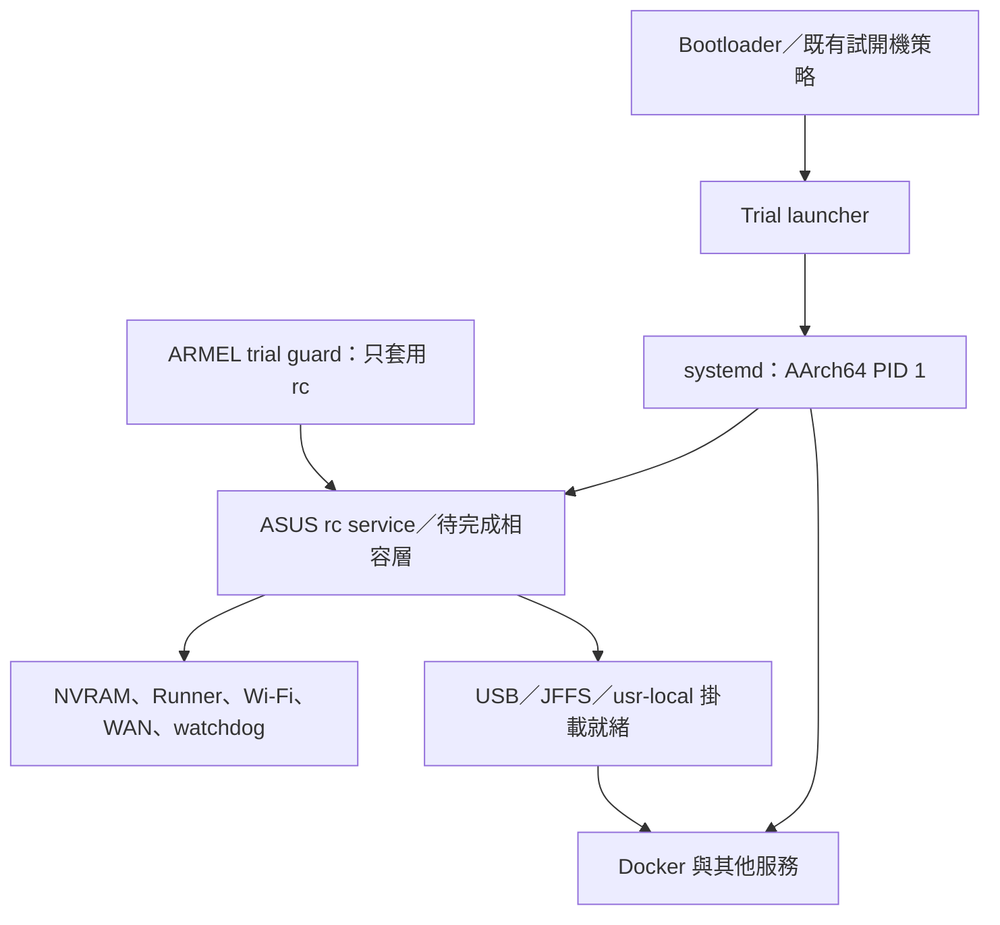

# GT-BE98 systemd 原型：原 #36 核心的 PID 1 驗證

2026-09-16。第一階段已通過 QEMU；沒有修改路由器、刷機或 firmware commit，尚未產生可刷入的 systemd 韌體。

## 結論與可行路線

現有 Linux 4.19.294 #36 可以執行這個最小 systemd 255 manager。第一階段不必更動核心或 Broadcom 模組；目前真正需要接續處理的是 ASUS `rc` 的程序身分、服務通知與關機流程。

採用 AArch64 systemd 管理服務，先保留 ASUS 的硬體初始化、網路控制、mdev 與 cgroup v1。PID 1 和啟動必要函式庫放在內部 rootfs `/usr`；USB 上的 `/usr/local` 在掛載完成後才提供 Docker 等後期服務。

下面是後續整合的目標關係，ASUS 服務化部分尚未實作：



## 本次實作與結果

以主機原生 AArch64 GCC 16.2.0、既有 glibc 2.44 sysroot 及 `-mcpu=cortex-a53+crc+crypto` 建置 systemd。Meson 的 cross-file 用來隔離同架構但不同 glibc 的目標環境與 loader；沒有在路由器編譯。

固定 systemd 255.22、commit `356c54394add8c6a1d52773852c23656590dc33b`。GitHub 回覆此 tag 的簽名驗證有效，證據保存在 `evidence/upstream-tag.json`；其餘來源下載後以 SHA-256 固定在 `configs/sources.json`。255.22 是本次相容性實驗基準，正式部署版本的維護修補仍需另行整合；可參考 [Ubuntu 24.04 的 255 維護來源](https://packages.ubuntu.com/noble/systemd)。不直接安裝整套 Ubuntu 套件與預設服務。

新增 runtime 為 systemd、executor、shutdown、systemctl、journald、journalctl、notify、run、兩個 systemd private libraries、libcap、libcrypt，以及 util-linux mount/umount。14 個 ELF 合計 6,408,136 bytes，全部記錄 Build ID、SHA-256 與 CPU 編譯旗標。GNU Build ID 是建置識別，不等同密碼學簽章。沿用韌體現有 libmount/libblkid 與 GCC/glibc runtime，沒有替換其他 ABI 的檔案。

最終 QEMU：`builds/qemu/stock36-guard-service/`，11.62 秒，無 panic，通過：

- systemd 成為真正 PID 1，private control socket 可用。
- `/run` 為獨立 tmpfs，`/var/run -> /run`；`/var` 仍為 RAM 上的可寫資料。
- `systemctl` 啟動、停止、重啟服務；主程序被測試故意終止後由 `Restart=on-failure` 復原。
- cgroup v1 的實際 `memory.limit_in_bytes=67108864`、`pids.max=16`，以及服務 `Delegate=yes`。
- journald 寫入、同步與讀回；journal 限於 RAM。
- PID 1 `daemon-reexec` 後重新接受管理指令。
- systemd 正常關機，最後卸載檔案系統並 power down；沒有卸載失敗。
- 真正的 ARMEL trial guard 在 systemd 啟動、PID 大於 1 的 ARMEL 服務中仍能攔截 metadata 寫入；讀取照常通過，exec 子程式不繼承 LD_PRELOAD。

最後一項使用沒有 NAND、檔案寫入或 reboot 呼叫的測試 provider。它驗證 ABI、載入方式和攔截行為；沒有試寫真實 boot metadata，也不代表已完成實機回退測試。測試 provider 及程式在 `scripts/guard-*.c`，不屬於正式 runtime。

## 實驗找出的整合問題

1. **通知端點確實綁死 PID 1。** 安裝版 ARMEL `libshared.so` SHA-256 為 `4e8298baebb5fcfbe46566bc4fb544b90bfe9e4abb2cb039042d1116b0b747eb`。`notify_rc` 的內部路徑在 `0x45020` 呼叫 `kill(1, SIGUSR1)`，前兩條設定參數的指令為 `mov r1,#10`、`mov r0,#1`。七個 ELF 直接匯入這组 API：libletsencrypt、libovpn、libwebapi、cfg_client、cfg_server、httpd、rc。這不包含直接呼叫 kill/syscall 或動態 dlsym 的其他路徑。
2. **不能只把 rc 放入 ExecStart。** 已保存來源的 `stop_httpd()` 會在 `getpid()!=1` 時轉呼叫 notify_rc 然後返回；rc 的通知迴圈使用 SIGUSR1，重啟工具直接向 PID 1 送 SIGTERM。若不建立正確的 ASUS manager 身分與通知端點，Web UI 的操作可能循環轉送或送錯程序。不能全域偽造 getpid()。
3. **掛載工具介面不同。** systemd 使用 `umount -c`，韌體 BusyBox umount 不支援。已原生建置 util-linux 2.42.2 的 mount/umount 至 `/usr/gnu/bin`，讓 systemd 明確使用它們；原 BusyBox 入口保留。
4. **ASUS /etc 在 /tmp 裡。** `/etc -> /tmp/etc` 必須隨服務一起保持可用。原型加入 `tmp.mount`，不讓通用 umount.target 提早卸載這個承載設定的 tmpfs；由 systemd-shutdown 在終止剩餘程序後完成卸載。最終日誌確認全部卸載成功。
5. **ARMEL preload 必須限定範圍。** systemd 本身是 AArch64，ARMEL guard 放在對應服務的 Environment 中，經 executor 套用至最終 ARMEL 程式。上述測試已確認這條邊界可以運作。

細節：`evidence/asus-rc-boundary.json`、`evidence/libshared-notify-disassembly.txt`、`evidence/runtime-overlay.json`。其他 QEMU 目錄保留初輪測試紀錄：漏建 /var/run、BusyBox sleep 不支援小數、systemctl 分頁器等待輸入，以及卸載順序；只有 `stock36-guard-service` 是最終採用結果。最早 runner 只記錄是否到達 power down，後續已改成同時要求成功測試標記，避免把提早退出當作驗證完成。

## 容量與原有內容

| 項目 | bytes |
| --- | ---: |
| 前一版無 ADSL 候選 rootfs | 74,629,120 |
| 本次 systemd 測試 rootfs | 76,587,008 |
| 新增壓縮空間 | 1,957,888（1.8671875 MiB） |
| 目前路由器安裝版 rootfs | 77,021,184 |

使用 zstd 22、1 MiB block、tailends。本原型包含測試 units 和 guard probes，仍比目前安裝版 rootfs 小 434,176 bytes。

依前次 UBI 觀察，rootfs 需 612 個 LEB；加上不變的 bootfs 107 個，可餘 15 個 LEB（1,904,640 bytes）。這是原型的大小估算，正式 rc 整合、必要安全功能與實際分區狀態仍須重新計算。

未刪除無 ADSL 基準的任何其他檔案，既有檔案內容、模式和連結全部保留，唯一既有路徑型態變更是 `/run` 由 symlink 改成實體目錄。全部 182 個核心模組相同；實驗 kernel 也是原 #36，SHA-256 `f6b32cfe97b9e7e2b818fd5aaf5b0a029f52d62dcf086546fd65ebf60c6da3d4`。

實驗 rootfs SHA-256：`b1c2fa82bc097a6510d485a73c9063bc3086c774423e07245708e366b2bccfe8`

initramfs SHA-256：`cee0bc72ccfbd2a10a73e2667afbba84f599ecdd8fc0dc159bc45c36a1bd1018`

## 下一階段與驗證邊界

下一步先建立 ASUS rc 的相容層：明確的 daemon 入口、manager 身分判斷、通知端點和關機契約。開源呼叫端可修改；沒有找到實作來源的 libshared 通知介面及其他二進位呼叫端需要分開處理與測試。Runner/DHD/rtl8372 的載入順序和原有 ASUS 網路控制保持為整合條件。

接著測真實 Docker/containerd/runc，在保留 cgroup v1 的前提下確認 driver、cgroup parent 與 delegation；本次測到的是 systemd 控制器行為，尚未在其下啟動 Docker daemon。

最後才整合 USB/JFFS 掛載、watchdog、Web UI 的 start/stop/restart、真實關機與試開機回退，再產生可刷映像。QEMU 沒有 Broadcom 真實硬體，本次沒有執行 ASUS rc，不能由此保證實機 Runner 吞吐或無線功能。

核心仍缺上游列出的 FHANDLE，且啟用了 deprecated sysfs。這次 manager 的成功不代表符合所有 systemd/udev 核心需求。正式候選需處理 FHANDLE 與 EXPORTFS 的 builtin/module 關係，重做 blob ABI 與 Btrfs 測試；udev 遷移另行驗證，第一階段保留 mdev。原型亦未啟用 seccomp、ACL、D-Bus 系統匯流排或 networkd/resolved，部署組態尚未定案。[systemd 255 核心與依賴要求](https://github.com/systemd/systemd-stable/blob/v255.22/README)、[上游 cgroup 版本說明](https://github.com/systemd/systemd/blob/main/docs/CGROUP_DELEGATION.md)。

## 重現

腳本均在本 checkpoint 工作；不含任何刷機指令。主機需要 Meson 1.3.2、Ninja、Python 3/pyelftools/Jinja2、autotools、binutils、SquashFS tools、QEMU。原生 GCC 16.2 工具鏈與 ARMEL GCC 15/glibc 2.44 測試 SDK 沿用前一 checkpoint，依賴指紋另存。

```sh
python3 systemd-lab-20260916/scripts/fetch-sources.py
python3 systemd-lab-20260916/scripts/prepare-sdk.py
python3 systemd-lab-20260916/scripts/build-deps.py
python3 systemd-lab-20260916/scripts/build-mount-tools.py
python3 systemd-lab-20260916/scripts/build-systemd.py
python3 systemd-lab-20260916/scripts/stage-systemd.py
python3 systemd-lab-20260916/scripts/build-guard-probe.py
python3 systemd-lab-20260916/scripts/prepare-guest.py --revision guard-service
python3 systemd-lab-20260916/scripts/run-qemu.py --label stock36-guard-service --kernel multiarch-loader-20260916/saved-inputs/Image36 --initrd systemd-lab-20260916/build/guard-service/guest.cpio.gz --timeout 120
python3 systemd-lab-20260916/scripts/finalize.py
```

重現時在新工作目錄操作：prepare-sdk/prepare-guest 會拒絕覆寫既有產物。來源 tarball 已固定 hash；若只重跑已保存的最終 QEMU guest，不需要編譯器或解包來源，使用新的 `--label` 即可。

## 保存與相依性

`scripts/snapshot-dependencies.py` 已逐一核對 6,838 個外部編譯器與 SDK 檔案，與前一份已驗證的 A53 runtime 備份一致。檔案指紋在 `evidence/external-compiler-fingerprints.json`，host tools 版本、ARMEL 測試編譯器及 ML350 備份位置在 `evidence/build-dependencies.json`。

本次 `systemd-lab-backup.tar` 保存上游來源 tarball、所有新腳本與 C 程式、設定、完整隔離 SDK、runtime overlay、最終 rootfs／initramfs、原 #36 kernel 和各次小型測試日誌。symlink 保持連結；沒有複製先前失敗測試的巨大映像。內容清單及整包 hash 分別在 `backup-manifest.json`、`backup-receipt.json`；ML350 收件與逐檔校验另存 `ml350-backup-receipt.json`。

完整重新編譯仍需要先前的 GCC／glibc checkpoint 和主機建置工具，本備份沒有重複收入整套編譯器。僅重跑保存的 guest 則不依賴這些編譯器。恢復時保留 workspace 相對目錄；無 ADSL 的基準可由保存的 `rootfs-no-adsl-20260916/build/zstd22-1m-tailends.squashfs` 解至該 checkpoint 的 `build/unpacked-rootfs`，以 `unsquashfs` 保留檔案權限和連結。新路徑下重新編譯時，重新產生 wrapper／Meson 設定，勿沿用舊絕對路徑。
